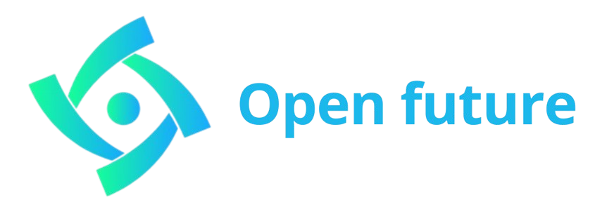
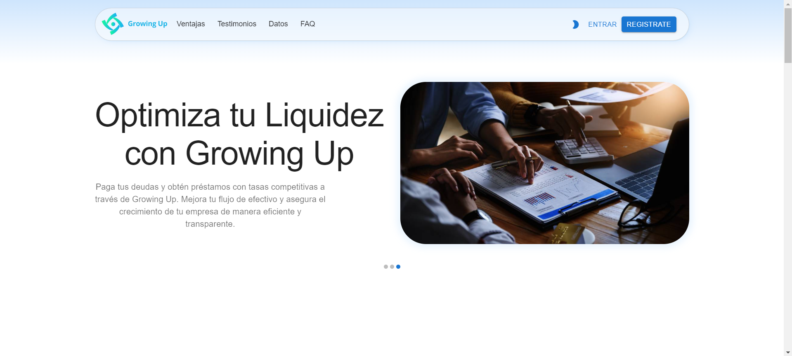
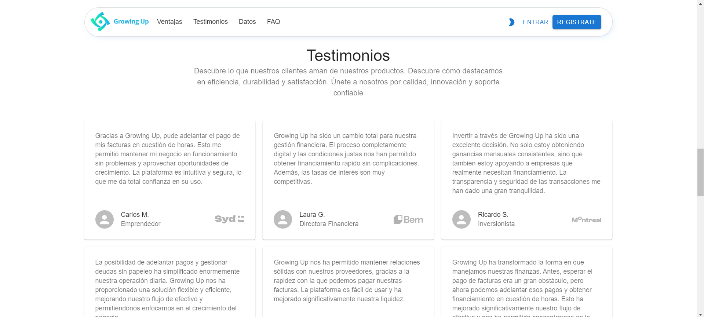
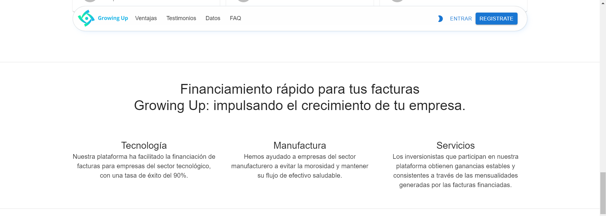
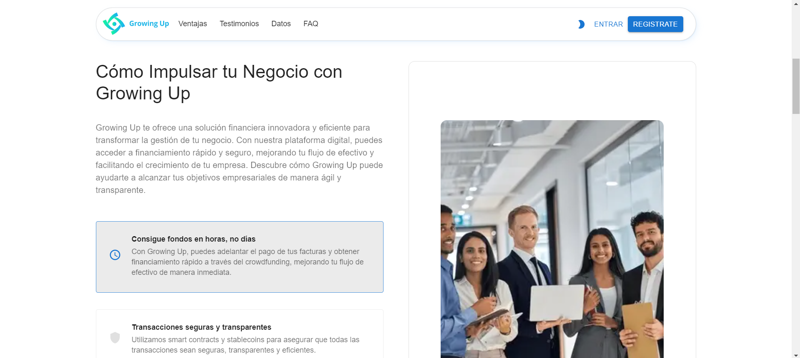
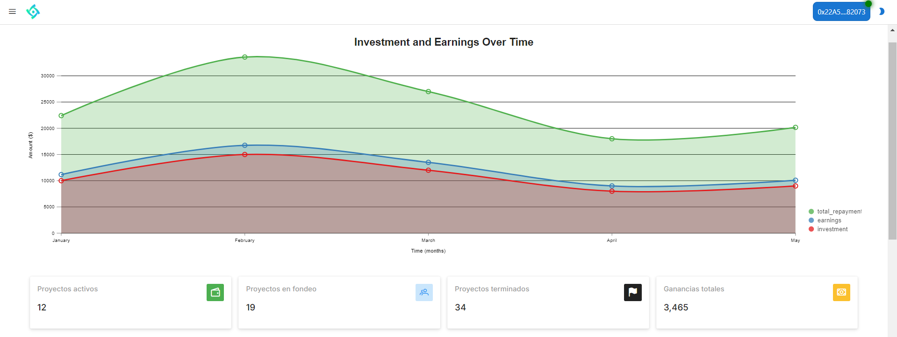
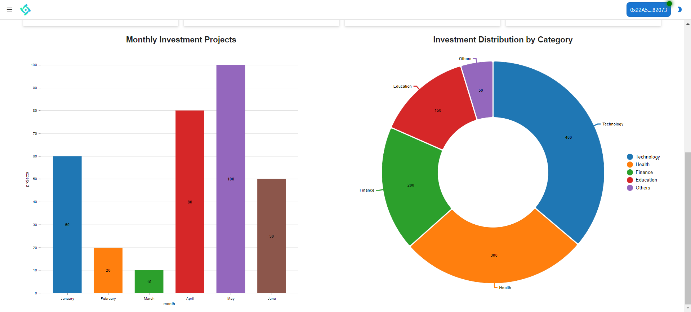
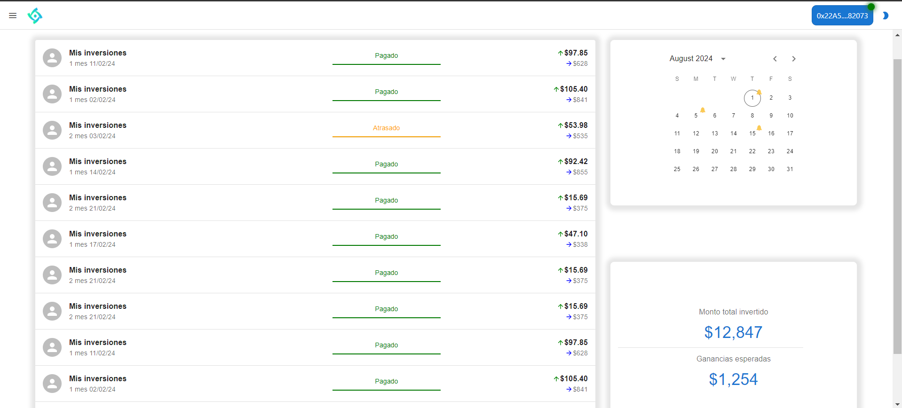
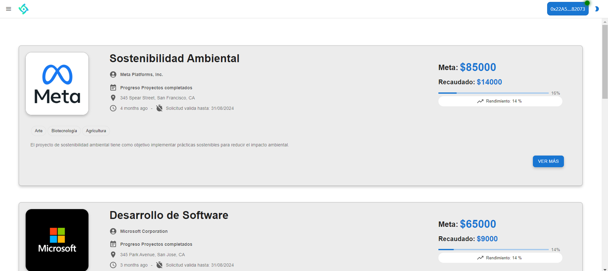

## QuickStarter

1. Clone the repository

        git clone https://github.com/HarielPS/open-future.git

2. Run npm install

        npm install

3. Start the project

        npm run dev

# Growing UP

*Empowering your dreams, building the future*

"Growing UP" is a decentralized crowdfunding platform on ZetaChain centered around Bitcoin. Our goal is to connect investors seeking returns in BTC with innovative projects needing funding, providing a secure and transparent environment.

## What Is It For?
Growing UP allows businesses to obtain the necessary capital to finance various projects through collaborative investments. Investors can participate in multiple projects from different blockchains, ensuring diversification and security of their investments.

Here is the link to our website:
[Growing Up](https://growing-up-angel-hack.netlify.app/)

[Demonstration Video](https://youtu.be/_0BpMj-AcPw)

# Contents

* [Home Page](#home-page)
* [Dashboard](#dashboard)
* [Portfolio](#portfolio)
* [History](#history)
* [Projects](#projects)
* [Value Proposition](#value-proposition)
* [Features and Functionalities](#features-and-functionalities)
* [Contributors](#contributors)

## Home Page

How does it work? Well, we have several sections, but let's look at the first view that is shown when accessing the app.

This space presents information about our application and offers several options to explore its content, including:

- **Testimonials:** Discover what our customers say about our products, highlighting efficiency, durability, and satisfaction.
  

- **Information on Financing:** Explanation of how Growing Up drives business growth through fast and transparent financing.
  

- **Advantages Section:** Highlights the advantages of investing and earning with Growing Up, including secure financing options and profitable investment opportunities.
  

This space also provides access to frequently asked questions and detailed information on how to use the Growing Up platform to achieve business goals in an agile and transparent manner.

## Dashboard
Provides an overview of the user's account status, investments, and earnings.

  

* **Metrics Visualization:**
  - **Active Projects:** Number of ongoing projects in which the user has invested.
  - **Total Investments:** Total amount the user has invested.
  - **Total Earnings:** Total earnings from all investments.
  - **Current Month Earnings:** Earnings for the current month.
  - **Upcoming Payments:** Total payments to be received in the next month.

* **Graphical Visualization:**
  - **Line Chart:** Growth of total investments over time.
  - **Pie Chart:** Breakdown of earnings by project categories.

## Portfolio
Provides detailed information about all investments and their status.

* **Detailed Investment List:**
  - Project name, investment amount, earnings obtained, next expected payment, and status (e.g., Current, Late, Completed).
  - Project categories and a brief description.

* **Graphical Visualization:**
  - **Bar Chart:** Investments by project categories.
  - **Line Chart:** Performance of individual investments over time.

## History
Displays the transaction history, including payments and investment schedules.

* **Transaction List:**
  - Lists all transactions with dates, amounts, and descriptions (e.g., Investment, Earnings, Withdrawal).

* **Calendar View:**
  - Highlights future payment dates and past transactions.
  - Color-coded for different types of transactions (e.g., Investment, Earnings).

* **Graphical Visualization:**
  - **Line Chart:** Track monthly earnings and investments over time.
  - **Pie Chart:** Breakdown of transaction types.

## Projects
Displays projects available for investment with detailed information.

  

* **Project List:**
  - Project name, description, categories, required amount, and current funding status.
  - Include project goals and expected returns.

* **Graphical Visualization:**
  - **Progress Bar:** Shows the funding progress for each project.
  - **Category Tags:** Visual tags for project categories (e.g., Technology, Health).

## Value Proposition

1. **Investment Diversification:** Investors can participate in multiple projects from different sectors and blockchains, increasing return opportunities.
2. **Increased Security:** The tokenization of real assets such as real estate, machinery, and inventory provides solid guarantees for investors.
3. **Transparency:** All processes are recorded on the blockchain, ensuring traceability and auditability.
4. **Accessibility:** The platform facilitates access to funding for innovative projects that would otherwise have difficulty obtaining it.

## Features and Functionalities

1. **Registration and Verification:**
   - Both investors and projects must register and be verified on the platform.
   - Projects must present a detailed and auditable business plan.

2. **Creation of Funding Campaigns:**
   - Projects create campaigns by setting the amount to be raised, the term, and the conditions.
   - The use of funds is detailed and guarantees offered are presented.

3. **Investment:**
   - Investors deposit BTC into a platform smart contract.
   - Funds are locked until funding goals are met or the term ends.

4. **Disbursement of Funds:**
   - Once the goal is reached, funds are released to the project.
   - A token representing the debt the project owes to investors is created.

5. **Guarantees and Recovery of Investments:**
   - **Asset Tokenization:** Projects tokenize real assets and deposit them in a smart contract. In case of default, investors can claim these assets.
   - **Founders' Personal Guarantee:** Project founders can offer their personal assets as collateral.
   - **Token Pledge:** Projects can pledge other tokens they own as collateral.
   - **Liquidity Pools:** Projects can contribute liquidity to DeFi protocol liquidity pools as collateral.
   - **Multisig Escrow:** Funds can be held in a multisig contract requiring multiple signatures for release.

6. **Additional Platform Features:**
   - **Reputation System:** A reputation system is implemented to assess the reliability of projects and investors.
   - **Oracle:** An oracle is used to obtain real-world data and validate the guarantees offered.
   - **Intuitive Interface:** The platform has an easy-to-use interface to facilitate user participation.
   - **Native Token:** A native token can be created to incentivize platform participation and govern its operation.

## Contributors

* [@Jan](https://github.com/janacostab) - Jan Acosta Becerril
* [@Marlon](https://github.com/Champagnepagcois) - Marlon Francois Rodriguez Cejudo
* [@Hariel](https://github.com/HarielPS) - Hariel Padilla Sanchez
